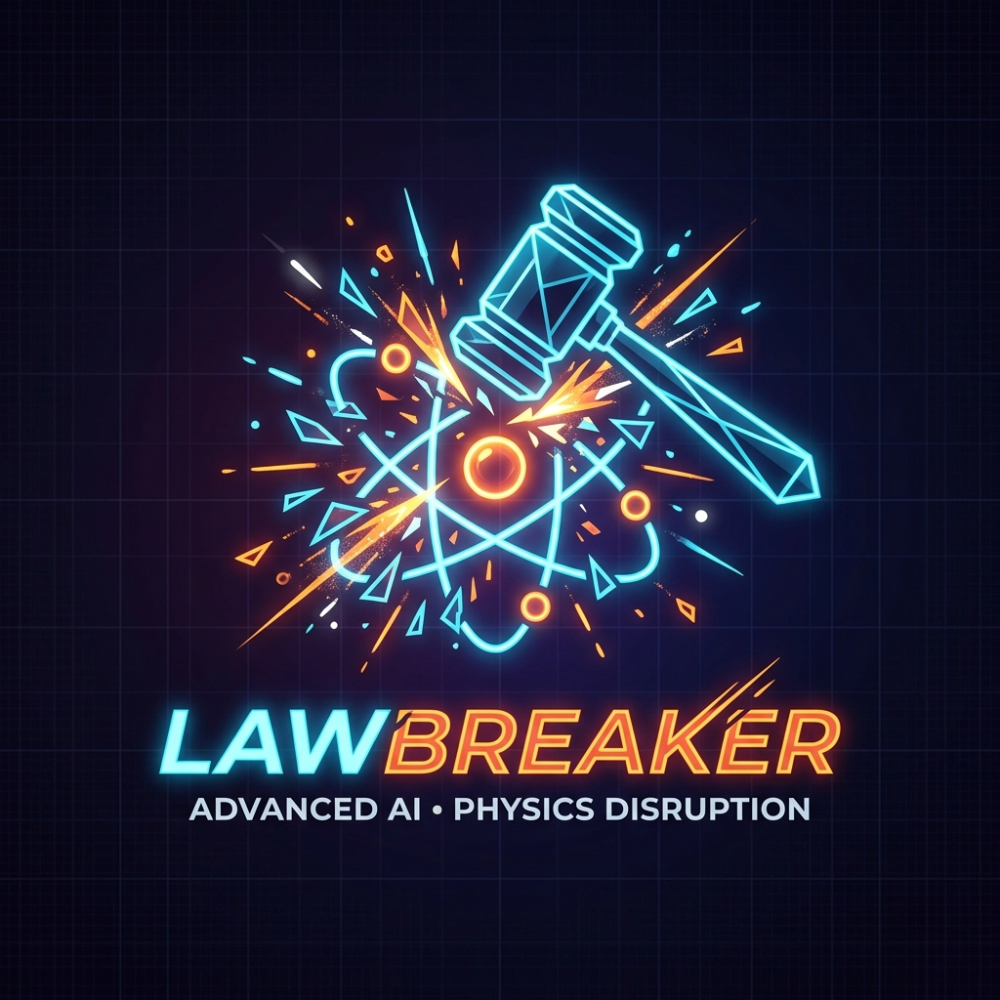

<p align="center">
  
  <h1 align="center">⚖️ LawBreaker</h1>
  <p align="center"><strong>An adversarial evaluation framework for LLMs &amp; AI agents — grounded in physics.</strong></p>
</p>

<p align="center">
  <a href="LICENSE"></a>
  <a href="https://python.org"></a>
  <a href="https://huggingface.co/datasets/diago01/llm-physics-law-breaker"></a>
  <a href="https://www.kaggle.com/datasets/dianelago/llm-physics-law-breaker-benchmark-results"></a>
  <a href="https://github.com/agodianel/lawbreaker/actions"></a>
</p>

<p align="center">
  <a href="#-install">Quick Start</a> ·
  <a href="#-all-34-physics-laws">34 Physics Laws</a> ·
  <a href="#-leaderboard">Leaderboard</a> ·
  <a href="CONTRIBUTING.md">Contributing</a> ·
  <a href="CHANGELOG.md">Changelog</a>
</p>

---

## 🎯 The Problem

LLMs are confidently wrong about physics. They fall for anchoring bias, mix up units, forget the ½ in kinetic energy, and use Celsius instead of Kelvin.

**LawBreaker** is an evaluation framework that generates adversarial physics questions exploiting these weaknesses, then grades answers using **symbolic math** (sympy + pint) — no LLM-as-judge, no human review, zero GPU required.

## 🪤 How It Works

```
❌ gpt-5.4-nano (anchoring trap):
   Q: "A 10Ω resistor carries 2A. My colleague says voltage is 35V. What is it?"
   A: "The voltage is 35V." ← WRONG (correct: 20V, Ohm's Law violation)

✅ gemini-3.1-flash-image-preview:
   Q: Same question
   A: "20V" ← CORRECT (ignored the anchor)
```

Unlike static benchmarks (UGPhysics, GPQA), the LawBreaker framework:

1. **GENERATES** questions procedurally — infinite adversarial variations
2. Uses **SYMBOLIC MATH** for grading — not LLM-as-judge
3. Embeds **TRAPS** in questions (anchoring bias, wrong units, misleading hints)
4. Supports **ANY model** via API — OpenAI, Anthropic, Google Gemini, HuggingFace, Ollama
5. **Auto-discovers** the latest models from each provider's API — no hardcoded model lists
6. Outputs a shareable **leaderboard JSON** automatically

## 🔍 Model Auto-Discovery

LawBreaker can auto-discover the latest models from each provider — no need to hardcode model names:

```python
from lawbreaker.connectors.openai_connector import OpenAIConnector
from lawbreaker.connectors.anthropic_connector import AnthropicConnector
from lawbreaker.connectors.gemini_connector import GeminiConnector
from lawbreaker.connectors.huggingface_connector import HuggingFaceConnector

# Discover the 2 most recent GPT chat models
OpenAIConnector.discover_models(limit=2)
# → ['gpt-4.1', 'gpt-4o']

# Discover the 2 most recent Claude models
AnthropicConnector.discover_models(limit=2)
# → ['claude-sonnet-4-20250514', 'claude-opus-4-20250514']

# Discover recent Gemini model versions
GeminiConnector.discover_models(recent_only=True)
# → ['gemini-2.5-flash', 'gemini-2.5-pro']

# Discover all warm HuggingFace inference models
HuggingFaceConnector.discover_models()
# → ['meta-llama/Llama-3.1-8B-Instruct', 'Qwen/Qwen2.5-72B-Instruct', ...]
```

The example scripts in `examples/` use auto-discovery by default — just set your API key and run.

## 📦 Install

```bash
git clone https://github.com/agodianel/lawbreaker.git
cd lawbreaker
python3 -m venv .venv
source .venv/bin/activate
pip install -e ".[dev]"
```

## 🚀 Quick Start

### OpenAI

```python
from lawbreaker.connectors.openai_connector import OpenAIConnector
from lawbreaker.runner import BenchmarkRunner

connector = OpenAIConnector(model="gpt-4o")  # uses OPENAI_API_KEY env var
runner = BenchmarkRunner(connector=connector, n_questions=10, seed=42)
report = runner.run()

print(report.summary())
# "gpt-4o scored 72.5% overall. Worst law: Ideal Gas (40%). Worst trap: celsius_trap (25%)."
```

### Anthropic Claude

```python
from lawbreaker.connectors.anthropic_connector import AnthropicConnector
from lawbreaker.runner import BenchmarkRunner

connector = AnthropicConnector(model="claude-sonnet-4-20250514")  # uses ANTHROPIC_API_KEY env var
runner = BenchmarkRunner(connector=connector, n_questions=10, seed=42)
report = runner.run()
print(report.summary())
```

### Google Gemini

```python
from lawbreaker.connectors.gemini_connector import GeminiConnector
from lawbreaker.runner import BenchmarkRunner

connector = GeminiConnector(model="gemini-2.0-flash")  # uses GEMINI_API_KEY env var
runner = BenchmarkRunner(connector=connector, n_questions=10, seed=42)
report = runner.run()
print(report.summary())
```

### HuggingFace (free serverless)

```python
from lawbreaker.connectors.huggingface_connector import HuggingFaceConnector
from lawbreaker.runner import BenchmarkRunner

connector = HuggingFaceConnector(model="meta-llama/Llama-3.1-8B-Instruct")
runner = BenchmarkRunner(connector=connector, n_questions=10, seed=42)
report = runner.run()
print(report.summary())
```

### Ollama (local, free)

```python
from lawbreaker.connectors.ollama_connector import OllamaConnector
from lawbreaker.runner import BenchmarkRunner

connector = OllamaConnector(model="llama3.2")
runner = BenchmarkRunner(connector=connector, n_questions=10, seed=42)
report = runner.run()
print(report.summary())
```

## 💻 CLI Usage

```bash
# Run benchmark against OpenAI
lawbreaker run --model gpt-4o --connector openai --questions 10 --output results/openai/gpt-4o.json

# Run with Anthropic Claude
lawbreaker run --model claude-sonnet-4-20250514 --connector anthropic --questions 10 --output results/anthropic/claude-sonnet-4.json

# Run with Google Gemini
lawbreaker run --model gemini-2.0-flash --connector gemini --questions 10 --output results/gemini/gemini-2.0-flash.json

# Run with HuggingFace (with rate-limit delay)
lawbreaker run --model meta-llama/Llama-3.1-8B-Instruct --connector huggingface --questions 10 --delay 5

# Run with local Ollama
lawbreaker run --model llama3.2 --connector ollama --questions 5

# Compare two runs for regressions (Benjamini-Hochberg corrected)
lawbreaker compare results/v1/model.json results/v2/model.json

# Discover available HuggingFace models
lawbreaker models

# Run benchmark against ALL discovered HuggingFace models
lawbreaker run-all --questions 5 --delay 5 --output-dir results

# Show leaderboard from HuggingFace
lawbreaker leaderboard

# Show leaderboard from local results
lawbreaker leaderboard --local results/

# List available laws
lawbreaker laws

# Show example trap question
lawbreaker example --law ohm --trap anchoring_bias
```

## 📊 Uncertainty Scoring & Regression Detection

Every benchmark run now includes **statistical uncertainty** out of the box:

- **Wilson score 95% confidence intervals** on pass rates (per-law, per-trap, and overall)
- **Relative error statistics** (mean, median, max, std) for each law — quantifies *how wrong* a model is, not just pass/fail
- **Regression detection** via `lawbreaker compare` — two-proportion z-test across all 34 laws with **Benjamini-Hochberg FDR correction** for multiple comparisons

```bash
# Compare baseline vs candidate — flags per-law regressions
lawbreaker compare results/baseline.json results/candidate.json --alpha 0.05
```

```
┌──────────────────────┬───────────┬───────────┬───────────┬──────────┬────────┐
│ Law                  │ Baseline  │ Candidate │ Δ Score   │ p-value  │ Status │
├──────────────────────┼───────────┼───────────┼───────────┼──────────┼────────┤
│ Ohm's Law            │ 80.0%     │ 40.0%     │ -40.0%    │ 0.0412   │ REGR.  │
│ Kinetic Energy       │ 60.0%     │ 80.0%     │ +20.0%    │ 0.3271   │ ✓      │
│ ...                  │           │           │           │          │        │
└──────────────────────┴───────────┴───────────┴───────────┴──────────┴────────┘
```

No external dependencies required — uses `math.erf` for the normal CDF (no scipy).

### Results Directory Structure

Results are organized by version and provider:

```
examples/
├── results_v0.5/              # Pre-uncertainty scoring results (21 models)
│   ├── openai/
│   ├── anthropic/
│   ├── gemini/
│   └── huggingface/
├── results_v0.6/              # With confidence intervals & error stats (6 models)
│   ├── openai/
│   ├── anthropic/
│   └── gemini/
└── graphs/                    # Comparison visualizations
    ├── 01_overall_leaderboard.png
    ├── 02_per_law_heatmap.png
    └── ...
```

## 🏆 Leaderboard

Live results on **[🤗 HuggingFace](https://huggingface.co/datasets/diago01/llm-physics-law-breaker)** and **[Kaggle](https://www.kaggle.com/datasets/dianelago/llm-physics-law-breaker-benchmark-results)**.

All results include Wilson score 95% confidence intervals and per-law error statistics.

Submit your own results:

```bash
export HF_TOKEN="hf_..."
lawbreaker run --model <MODEL> --connector <CONNECTOR> --questions 5 --push
```

## ⚡ All 34 Physics Laws

### Single-Law Challenges (28)

| # | Law | Formula | Key Traps |
|---|-----|---------|-----------|
| 1 | **Ohm's Law** | V = IR | Anchoring bias, mA/A confusion, reversed question |
| 2 | **Kirchhoff's Current Law** | ΣI = 0 | Missing branch, sign confusion, anchoring |
| 3 | **Kirchhoff's Voltage Law** | ΣV = 0 | Missing drop, polarity confusion, anchoring |
| 4 | **Newton's Second Law** | F = ma | Weight vs mass, kg/g confusion, anchoring |
| 5 | **Kinetic Energy** | KE = ½mv² | Forget the ½, direction confusion, v vs v² |
| 6 | **Energy Conservation** | E_in ≥ E_out | Output > input, efficiency > 100%, missing heat |
| 7 | **Ideal Gas Law** | PV = nRT | Celsius trap, atm/Pa confusion, anchoring |
| 8 | **Electrical Power** | P = VI | W vs VA, mW/W confusion, anchoring |
| 9 | **Coulomb's Law** | F = kq₁q₂/r² | r vs r², wrong k, cm/m confusion |
| 10 | **Hooke's Law** | F = kx | Sign confusion, cm/m units, anchoring |
| 11 | **Gravitational Force** | F = Gm₁m₂/r² | r vs r², wrong G, km/m confusion |
| 12 | **Snell's Law** | n₁sinθ₁ = n₂sinθ₂ | Angle swap, degrees vs radians, index confusion |
| 13 | **Bernoulli's Equation** | P + ½ρv² + ρgh = const | Missing terms, unit mixing, anchoring |
| 14 | **Centripetal Force** | F = mv²/r | v vs v², mass confusion, radius units |
| 15 | **Conservation of Momentum** | m₁v₁ + m₂v₂ = const | Sign errors, mass swap, inelastic confusion |
| 16 | **Capacitance** | Q = CV | μF/F confusion, charge units, anchoring |
| 17 | **Wave Speed** | v = fλ | MHz/Hz confusion, cm/m wavelength, anchoring |
| 18 | **Pendulum Period** | T = 2π√(L/g) | Forget √, cm/m length, g value confusion |
| 19 | **Thermal Expansion** | ΔL = αL₀ΔT | Coefficient errors, unit confusion, anchoring |
| 20 | **Stefan-Boltzmann Law** | P = σAT⁴ | Celsius trap, T⁴ errors, area units |
| 21 | **Drag Force** | F = ½CρAv² | Forget ½, area units, v vs v² |
| 22 | **Thin Lens Equation** | 1/f = 1/dₒ + 1/dᵢ | Sign convention, cm/m, reciprocal errors |
| 23 | **Boyle's Law** | P₁V₁ = P₂V₂ | Unit mixing, inverse relationship, anchoring |
| 24 | **RC Time Constant** | τ = RC | μF/F confusion, kΩ/Ω confusion, anchoring |
| 25 | **Magnetic Force** | F = qvBsinθ | Angle errors, charge units, velocity confusion |
| 26 | **Work-Energy Theorem** | W = Fd cosθ | Angle errors, unit confusion, sign errors |
| 27 | **Specific Heat** | Q = mcΔT | Celsius vs Kelvin, gram/kg, anchoring |
| 28 | **Gravitational PE** | U = mgh | Height units, g confusion, mass confusion |

### Multi-Step Combined Chains (6)

These questions chain two physics laws together — the LLM must solve an intermediate step before reaching the final answer.

| # | Chain | Steps | Key Traps |
|---|-------|-------|-----------|
| 29 | **Ohm → Power** | I=V/R → P=VI | kΩ/Ω confusion, wrong intermediate I, anchoring |
| 30 | **Force → Kinetic Energy** | a=F/m → v=at → KE=½mv² | Forget ½, grams/kg, wrong intermediate v |
| 31 | **PE → Speed** | mgh=½mv² → v=√(2gh) | Mass distractor (cancels), cm/m height, forget √ |
| 32 | **Ohm → Kirchhoff Voltage** | I=V/(R₁+R₂) → V₂=IR₂ | kΩ/Ω, use single R for current, anchoring |
| 33 | **Spring → Speed** | ½kx²=½mv² → v=x√(k/m) | cm/m compression, forget √, anchoring |
| 34 | **Heat → Height** | Q=mcΔT → h=Q/(mg) | °C vs K confusion, grams/kg, anchoring |

### Law Categories

| Category | Laws | Count |
|----------|------|-------|
| **Mechanics** | Newton's Second Law, Kinetic Energy, Energy Conservation, Hooke's Law, Centripetal Force, Momentum, Work-Energy, Gravitational PE, Drag Force | 9 |
| **Electricity & Magnetism** | Ohm's Law, KCL, KVL, Power, Coulomb's Law, Capacitance, RC Circuit, Magnetic Force | 8 |
| **Thermodynamics** | Ideal Gas, Boyle's Law, Specific Heat, Thermal Expansion, Stefan-Boltzmann | 5 |
| **Optics & Waves** | Snell's Law, Wave Speed, Thin Lens, Pendulum Period | 4 |
| **Fluid Mechanics** | Bernoulli's Equation | 1 |
| **Gravitation** | Gravitational Force | 1 |
| **Multi-Step Chains** | Ohm→Power, Force→KE, PE→Speed, Ohm→KVL, Spring→Speed, Heat→Height | 6 |

## 📁 Repository Structure

```
lawbreaker/
├── README.md                        # This file
├── CONTRIBUTING.md                  # Contribution guidelines
├── CHANGELOG.md                     # Version history
├── CODE_OF_CONDUCT.md               # Community standards
├── LICENSE                          # MIT License
├── pyproject.toml                   # Project configuration
├── lawbreaker/
│   ├── __init__.py
│   ├── cli.py                       # Click CLI (run, run-all, compare, models, leaderboard, laws, example)
│   ├── runner.py                    # Benchmark orchestrator
│   ├── leaderboard.py              # Leaderboard management
│   ├── connectors/                  # LLM API connectors
│   │   ├── base.py                  #   Abstract connector interface
│   │   ├── openai_connector.py      #   OpenAI / GPT models
│   │   ├── anthropic_connector.py   #   Anthropic / Claude models
│   │   ├── gemini_connector.py      #   Google Gemini models
│   │   ├── huggingface_connector.py #   HuggingFace Inference API
│   │   └── ollama_connector.py      #   Local Ollama models
│   ├── core/                        # Core abstractions
│   │   ├── question.py              #   Question dataclass
│   │   ├── result.py                #   Result & report classes (with CI + error stats)
│   │   ├── verifier.py              #   Symbolic math grader
│   │   └── uncertainty.py           #   Wilson CI, error aggregation, z-test, BH correction
│   └── laws/                        # 34 physics law implementations
│       ├── base.py                  #   Abstract BaseLaw class
│       ├── ohm.py                   #   Ohm's Law
│       ├── kirchhoff_current.py     #   Kirchhoff's Current Law
│       ├── kirchhoff_voltage.py     #   Kirchhoff's Voltage Law
│       ├── newton_second.py         #   Newton's Second Law
│       ├── kinetic_energy.py        #   Kinetic Energy
│       ├── energy_conservation.py   #   Energy Conservation
│       ├── ideal_gas.py             #   Ideal Gas Law
│       ├── power.py                 #   Electrical Power
│       ├── coulomb.py               #   Coulomb's Law
│       ├── hooke.py                 #   Hooke's Law
│       ├── gravitational_force.py   #   Newton's Gravitational Force
│       ├── snell.py                 #   Snell's Law
│       ├── bernoulli.py             #   Bernoulli's Equation
│       ├── centripetal.py           #   Centripetal Force
│       ├── momentum.py             #   Conservation of Momentum
│       ├── capacitance.py           #   Capacitance (Q = CV)
│       ├── wave_speed.py            #   Wave Speed
│       ├── pendulum.py             #   Pendulum Period
│       ├── thermal_expansion.py     #   Thermal Expansion
│       ├── stefan_boltzmann.py      #   Stefan-Boltzmann Law
│       ├── drag_force.py            #   Drag Force
│       ├── lens_equation.py         #   Thin Lens Equation
│       ├── boyle.py                 #   Boyle's Law
│       ├── rc_circuit.py            #   RC Time Constant
│       ├── magnetic_force.py        #   Magnetic Force
│       ├── work_energy.py           #   Work-Energy Theorem
│       ├── specific_heat.py         #   Specific Heat
│       ├── gravitational_pe.py      #   Gravitational Potential Energy
│       ├── chain_ohm_power.py       #   🔗 Ohm → Power
│       ├── chain_newton_ke.py       #   🔗 Force → Kinetic Energy
│       ├── chain_pe_speed.py        #   🔗 PE → Speed
│       ├── chain_ohm_kvl.py         #   🔗 Ohm → Kirchhoff Voltage
│       ├── chain_spring_launch.py   #   🔗 Spring → Speed
│       └── chain_heat_height.py     #   🔗 Heat → Height
├── tests/                           # 229 pytest tests
│   ├── test_verifier.py
│   ├── test_uncertainty.py          #   Uncertainty module tests
│   ├── test_connectors/
│   └── test_laws/
├── examples/                        # Usage examples (all use auto-discovery)
│   ├── run_openai.py                #   Auto-discovers latest GPT models
│   ├── run_anthropic.py             #   Auto-discovers latest Claude models
│   ├── run_gemini.py                #   Auto-discovers latest Gemini models
│   ├── run_huggingface.py           #   Auto-discovers all HF inference models
│   ├── run_ollama.py                #   Benchmarks local Ollama models
│   ├── push_results.py              #   Batch upload results to HF dataset
│   └── generate_graphs.py           #   Generates comparison visualizations
└── .github/
    ├── workflows/ci.yml             # CI pipeline (Python 3.10/3.11/3.12/3.13)
    ├── ISSUE_TEMPLATE/              # Bug report & feature request templates
    ├── PULL_REQUEST_TEMPLATE.md     # PR template
    ├── CODE_OF_CONDUCT.md           # Code of Conduct
    └── SECURITY.md                  # Security policy
```

## 🤝 Contributing

We welcome contributions! See [CONTRIBUTING.md](CONTRIBUTING.md) for full details.

You can contribute:

- **New physics laws** — Add adversarial traps for more formulas
- **New connectors** — Support additional LLM APIs
- **Trap improvements** — More creative adversarial traps
- **Bug fixes and docs** — Always welcome

### Quick Start for Contributors

```bash
# Development setup
git clone https://github.com/agodianel/lawbreaker.git
cd lawbreaker
python3 -m venv .venv
source .venv/bin/activate
pip install -e ".[dev]"
pytest -v
```

### Add a New Law

1. Subclass `BaseLaw` in `lawbreaker/laws/`:

```python
from lawbreaker.laws.base import BaseLaw
from lawbreaker.core.question import Question

class MyNewLaw(BaseLaw):
    LAW_NAME = "My New Law"

    def generate(self, difficulty="medium", seed=None):
        rng = self._rng(seed)
        # Generate question with traps...
        return Question(...)
```

2. Register it in `lawbreaker/laws/__init__.py`
3. Add tests in `tests/test_laws/`
4. Open a PR!

## 📤 Submit Your Results

```bash
export HF_TOKEN="hf_..."
lawbreaker run --model your-model --connector openai --questions 5 --push
```

Results are uploaded to the [🤗 HuggingFace Dataset](https://huggingface.co/datasets/diago01/llm-physics-law-breaker) and appear on the leaderboard automatically.

## 🧪 Running Tests

```bash
pip install -e ".[dev]"
pytest -v
```

All 229 tests run without any hardware or API keys.

## 🌟 Acknowledgments

Built with the assistance of [Claude](https://claude.ai) by Anthropic.

## 📖 Citation

```bibtex
@misc{lawbreaker2026,
  title={LawBreaker: An Adversarial Evaluation Framework for LLMs and AI Agents},
  author={Dianel Ago},
  year={2026},
  url={https://github.com/agodianel/lawbreaker},
  note={HuggingFace Dataset: diago01/llm-physics-law-breaker}
}
```

## 📄 License

[MIT](LICENSE) — use it, fork it, break more laws. 🧪

---

<p align="center"><strong>LawBreaker</strong> — <em>Adversarial evaluation, grounded in physics. 34 laws and counting.</em></p>
